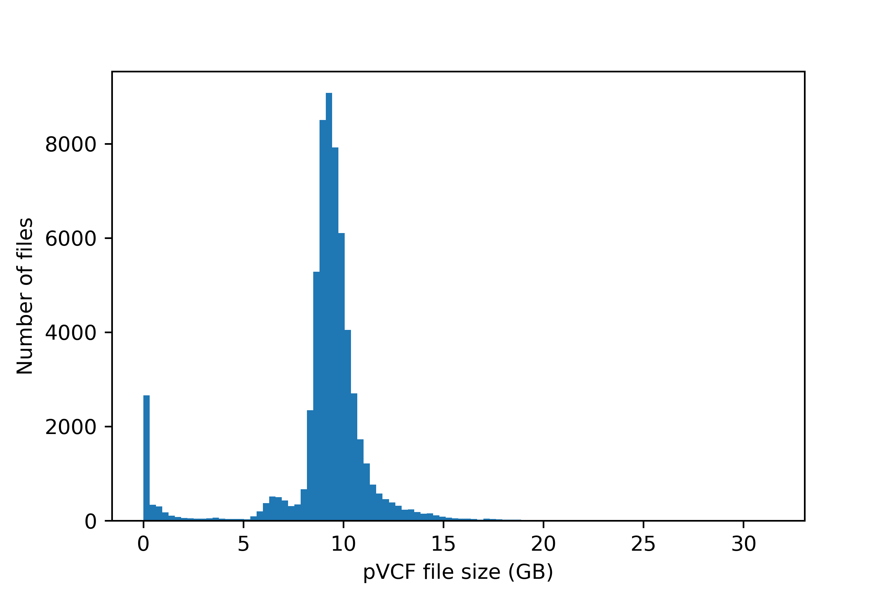
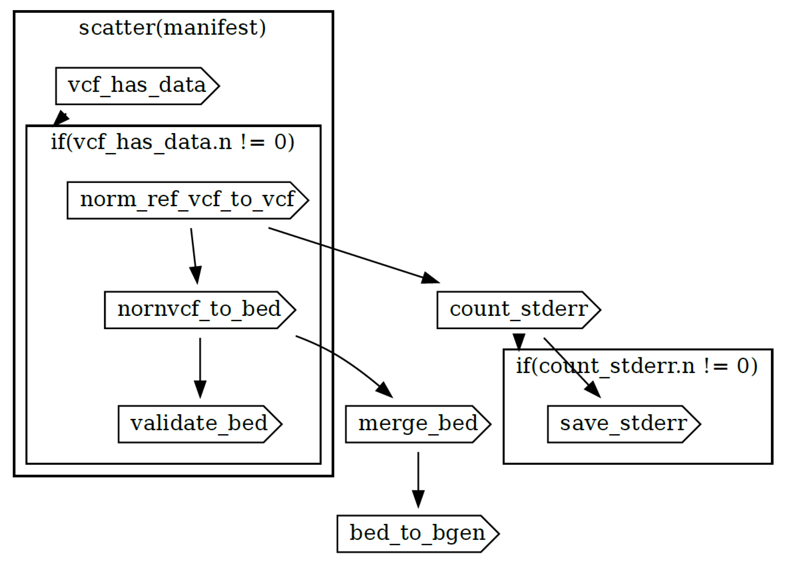

## **Conversion of text formatted population variants (pVCF) to binary formats (PLINK and BGEN) for 200k GraphTyper call**

### **Executive summary**

- 200k joint variant calls were converted from pVCF to BGEN and PLINK (BED/BIM/FAM
formats)
- 60648 pVCF files processed, producing ~540TB of intermediate files (multiallelic split and
normalized VCFs + unmerged BED) and ~30TB final data (chromosome merged PLINK and
BGEN files)
- The pipeline complexity can be significantly reduced by migrating to PLINK 2.0
(pgen/pvar/psam) format, which supports multiallelic variants and produces much smaller
files
- GraphTyper calls on 200k cohort introduced some large, very complex multiallelic variants
(>2GB of data in single pVCF line), which lead to issues with bcftools and PLINK. Implemented methods to deal with this (see below) may not suffice if applied to other (larger) dataset fields (e.g. 500k)
- The file size significantly increased in comparison to the 150k joint-call run (median of
9.36GB for 200k vs. 5.73GB for 150k), requiring machines with more operating memory to
successfully finish the conversion task
- When subsequently retesting the pipeline in preparation for release to the public, 935 chromosome 21 VCF files from field 24304 totalling ~7.2Tb were processed in 17h 27m costing B#40.11
- Should be implemented via Unix commands in an environment featuring the `dx` command-line client (https://documentation.dnanexus.com/getting-started/cli-quickstart). However, individual steps should be executable on any Unix-compatible machine (Linux, MacOS, WSL) to produce the same result.

### **Scope**

This document contains a protocol for converting the pVCF files to binary formats. The protocol is
optimized to run on the RAP platform provided by DNA Nexus. It is a reimplementation of the PLINK 1.9 format (bed/bim/fam) protocol used for the 150k cohort in the DNA Nexus platform workflow. The workflow code is available in WDL format.

### **Disclaimer**

This repository contains copies of third-party non-proprietary software. These include *BCFTools* version 1.16 issued under joint MIT/GPL licencing (https://github.com/samtools/bcftools?tab=License-1-ov-file#readme) and *Plink* (versions v1.90b6.27 and v2.00a3.6LM) issued under the GPLv3+ licence (https://www.cog-genomics.org/plink/1.9/dev; https://www.cog-genomics.org/plink/2.0/dev). 

UK Biobank does not warrant the accuracy, completeness, reliability, or fitness for any particular purpose of the workflow or any of the third-party non-proprietary software. The workflow is provided on an *as is* and *as available* basis, without any warranties or conditions of any kind, whether express or implied and UK Biobank disclaim and do not accept any liability to you. Users assume all risks and responsibilities associated with the use of the workflow and the third-party non-proprietary software.

In no event shall UK Biobank be liable to a user for any claim, damages or any other liability, including any general, special, direct, indirect, consequential, or incidental damages or any damages whatsoever, arising from, out of, or in connection with these resources or the use or other dealings connected with them. 

UK Biobank stresses that users should check their own licencing requirements before implementing this workflow. See further licencing information at the bottom of this document.

### **Steps of the protocol**

- Variant normalization and splitting multiallelic variants
- Conversion to PLINK (bed) format
- QC for converted files
- Merging PLINK (bed) files for each chromosome
- Conversion of chromosome PLINK (bed) to BGEN format

### **Software prerequisites**
- dx utility [API v1.0.0, client v0.317.0] - required for accessing the project file system and
submitting jobs on the RAP platform
- plink [PLINK v1.90b6.27 64-bit (10 Dec 2022)] - required for pVCF to BED format conversion
- plink2 [PLINK v2.00a3.6LM AVX2 Intel (14 Aug 2022)] - required for merging BED files and
conversion to BGEN format
- bcftools [v1.16] - required for normalization, splitting multiallelic variants
- bcftools [v1.16m] - a custom build, a modified version of bcftools that accepts VCF lines >2GB and <~4GB; if this version fails the pipeline falls back on the default version that omits problematic lines

### **Input files**

The input variant calls are stored in pVCF files. The project consists of 60,648 pVCF files and a total of 546.49TB of compressed text data. The file sizes range from 1.55 MB to 31.48 GB with a median size of 9.36 GB. The distribution of file sizes is shown in figure 1.

\
The smallest file size (1.55 MB) indicates that the pVCF file contains only a header. In a previous implementation, we will make use of this information to quickly identify empty pVCF files and omit them from being processed. However, because of a different number of individuals, the size of "empty" pVCF changes between releases. A new effective algorithm was implemented to identify "empty" pVCFs based on the absence of data lines. This approach would work universally, without the need to a priori determine the header size. Skipping header-only pVCF is important because processing empty files result in a PLINK executable error and incur the cost of setting up the instance and starting the execution.

### **Output files**

- PLINK BED files (26.84 TB)
- BGEN files (0.87 TB)

### **The conversion protocol**

This protocol is implemented as DNA Nexus workflow, and is available as a WDL file in the
repository, along with additional documentation and Docker build files. Corresponding WDL task names are shown in square brackets. It takes a list of pVCF files (RAP file-IDs) for a single chromosome as an input (up to ~5000 pVCF files) and returns merged PLINK and BGEN files alongside validation outputs and a list of failed (~4GB or larger) pVCF lines.

### **Implementation**

Please note, you must have Java installed in a Linux work environment (e.g., local machine or RAP instance): https://www.java.com/en/download/manual.jsp

- clone repo
- create Docker images and upload to your RAP project
- compile the workflow to RAP using dx compiler
- prepare the input (.json) file
- run workflow (vcf => normalization => bed/bim/fam conversion => consolidation => merge BED => convert to BGEN)

#### **Main Steps**

#### (i) Initialise all executables in this repo.
From the root directory of this repo type this command in a Linux terminal: \
`find ./ -name "*.sh" | xargs chmod a+x`

#### (ii) Obtain *GRCh38* reference genome

In your UKB-RAP Linux terminal, download three *GRCh38* reference genome files with the following suffixes: *.fa*, *.fai*, and *.dict*. 

These can be obtained from the following URL: https://ftp.1000genomes.ebi.ac.uk/vol1/ftp/technical/reference/GRCh38_reference_genome/ - for example, by using the bash `wget` command. After downloading, place them in a directory in your RAP project. You can create directories on your RAP project space with the `dx mkdir` command (e.g. `dx mkdir hg38`). Then, upload the files to this location using the `dx upload` command. E.g., `dx upload GRCh38* --path hg38/`.

#### (iii) Create and upload *Docker* container images to your RAP project: `build.sh` (x3)
The repository contains three folders named *docker_\** alongside a file named *docker.env*.

First, edit the *docker.env* file so the variable **REF** (currently set with a placeholder) points to the directory on the RAP where you have placed the *GRCh38* reference genome files (e.g. *hg38*). These reference genome files will be incorporated into one of the *Docker* images.

Next, set the variable **PTH** (currently set with a placeholder) to the directory on the RAP you wish your *Docker* images to be stored (NB you may stipulate a subdirectory - e.g. *wdl/docker*). E.g. `dx mkdir wdl`; `dx mkdir wdl/docker`. If you wish you may change this location (i.e. name the directories as you see fit), but wherever you upload these images you will need to add the path information when preparing your input manifest (see *iii* below).

Next, navigate to each *docker_\** folder. Run the build scripts in each folder: `./build.sh` - upon completion each script will upload a separate *Docker* image to the path you stipulated in *docker.env*.

#### (iv) Compile the WDL on your RAP project: `compile_wdl.sh`
You will require the *dxCompiler* utility: *https://github.com/dnanexus/dxCompiler/releases* - download it (you can use `wget` with the URL) and place in the folder named ***wdl***. This was tested (July 2024) using version *dxCompiler-2.11.5.jar*

After navigating by terminal into the *wdl* folder, you will notice there are two environmental variables that you need to tailor within the accompanying file, *compile_wdl.env* (located in the *wdl* folder), according to your workflow: (i) the version of the *dxCompiler* jar file you are using (variable **DXC**; currently set as *dxCompiler-2.11.5.jar*); and (ii) the path on your RAP project where you wish the workflow to be located (**WDL_LOC**; currently set with a placeholder). When these are set simply run the compiler: `./compile_wdl.sh`

#### (v) Prepare an input manifest file of files to be processed: `prep_manifest.sh`
Navigate back by terminal into the main folder. To run this script you need to set environmental variables in the accompanying file, *prep_manifest.env*, with the UKB field (variable **FIELD**; currently set as "24304") and chromosome number (**CHR**; currently set as "21") of the VCFs you are working (NB script will list all held pVCFs for the field and chromosome you are processing), alongside the path to your *Docker* files (**PTH**; currently set with a placeholder) already uploaded to the RAP in section (i). Then run as: `./prep_manifest.sh`

#### (vi) Run the workflow: `run.sh`
The accompanying file *run.env* requires the chromosome number (variable **CHR**; currently set as "21"), the path to the WDL workflow on your RAP project (**WDL_LOC**; currently set with a placeholder), and the output files destination folder on your RAP project (**DEST**; currently set with a placeholder). Then, run your job: `./run.sh`

### **Programmatic outline of workflow**

#### (i) Check if pVCF file has data (discard header-only, "empty" files)
`cat "~{vcf}" 2>/dev/null | zgrep "^[^#]" 2>/dev/null | head -1 | wc -l`

This efficient bash script returns 1 if file has data and 0 if file is empty.

#### (ii) Split multialleic variants and normalise pVCF
`bcftools norm "~{vcf}" \`
\
`-f /data/GRCh38_full_analysis_set_plus_decoy_hla.fa \`
\
`-m -any -Oz --no-version --threads 4 \`
\
`-o "~{prefix}".norm.vcf.gz || \`
\
`bcftools_vanilla norm "~{vcf}" \`
\
`-f /data/GRCh38_full_analysis_set_plus_decoy_hla.fa \`
\
`-m -any -Oz --no-version --threads 4 \`
\
`-o "~{prefix}".norm.vcf.gz 2> "~{prefix}".norm.stderr.txt || true`

This script uses a modified *BCFtools* binary to attempt to process the lines >2GB. If the line largely exceeds 2GB (~4GB or bigger) this script still fails and the pipe will fall back on standard *BCFtools* implementation (*bcftools_vanilla*). This script will omit problematic lines (reporting them to stdout, captured by workflow logging) and output the process file. Finally, "|| true" will guarantee the workflow will continue even if *BCFtools* return output to stderr. The workflow will only fail on no VCF file is produced, or conversion abnormalities are detected by the PLINK validation step.

#### (iii) Convert normalized pVCF to PLINK
`plink --make-bed \`
\
`--vcf "~{nornvcf}" \`
\
`--keep-allele-order \`
\
`--vcf-idspace-to _ \`
\
`--double-id \`
\
`--allow-extra-chr 0 \`
\
`--vcf-half-call m \`
\
`--out "~{prefix}"`

#### (iv) Validate PLINK file
`plink2 --validate --bed "~{bed}" --bim "~{bim}" --fam "~{fam}" > "~{prefix}".BedValid.txt`

### Additional third-party software licencing information

**The following software have been included with this repository:**

1. *BCFtools* version 1.16; licence: https://github.com/samtools/bcftools?tab=License-1-ov-file#readme \
*BCFtools* UK Biobank modified version 1.16; licence: https://github.com/samtools/bcftools?tab=License-1-ov-file#readme \

2. *Plink* version v1.90b6.27 64 bit; licence: https://www.cog-genomics.org/plink/1.9/dev

3. *Plink2* version v2.00a3.6LM AVX2 Intel; licence: https://www.cog-genomics.org/plink/2.0/dev

